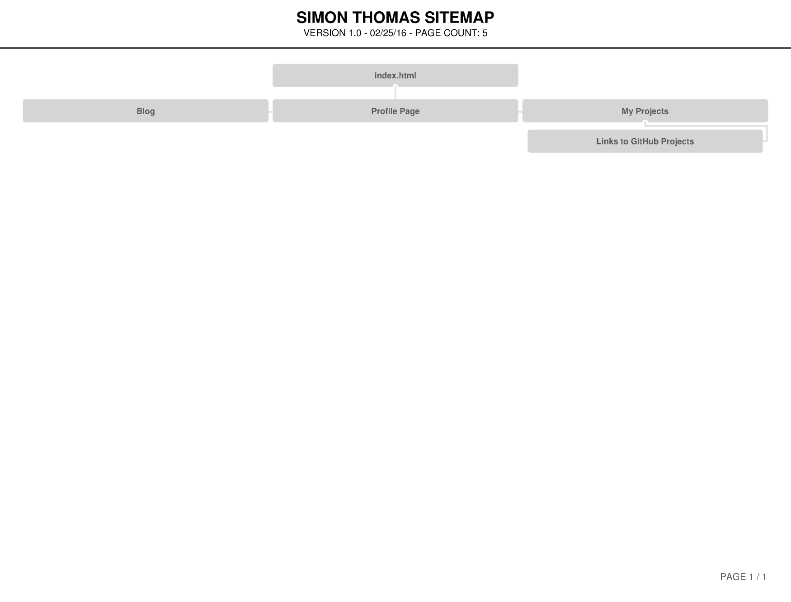

<html>
<head>
  <title>Reflecting on Design</title>
</head>
<body>
  
  
 Here we see the map of my site, known as a site map. Very advanced stuff. 

  
 Here's an attempt at a second picture, stored in the imgs folder

  
</body>
</html>